```mermaid
graph LR
    %% Frontend Layer
    subgraph Frontend["🌐 Frontend Layer"]
        FE["<div style='font-size:40px'>▲</div><div style='font-size:10px'>Vercel<br/>React/Next.js</div>"]
    end

    %% Backend Layer
    subgraph Backend["⚙️ Backend Layer"]
        BE["<div style='font-size:40px'>🚀</div><div style='font-size:10px'>Railway<br/>FastAPI</div>"]
        MCP["<div style='font-size:40px'>⚡</div><div style='font-size:10px'>MCP Server<br/>(FastMCP or Local SQLite)</div>"]
    end

    %% AI Components
    subgraph AI["🤖 AI Components"]
        LG["<div style='font-size:40px'>🤖</div><div style='font-size:10px'>LangGraph<br/>Agent Workflow</div>"]
        LS["<div style='font-size:40px'>📊</div><div style='font-size:10px'>LangSmith<br/>Tracing</div>"]
        AzureLLM["<div style='font-size:40px'>☁️</div><div style='font-size:10px'>Azure OpenAI<br/>GPT-4o/4o-mini</div>"]
        AzureEmbed["<div style='font-size:40px'>🧮</div><div style='font-size:10px'>Azure OpenAI<br/>Embeddings</div>"]
        AzureTrans["<div style='font-size:40px'>🌐</div><div style='font-size:10px'>Azure Translator<br/>Language Detection</div>"]
        Cohere["<div style='font-size:40px'>🎯</div><div style='font-size:10px'>Cohere<br/>Reranking</div>"]
    end

    %% Data Storage
    subgraph Data["💾 Data Storage"]
        Chroma["<div style='font-size:40px'>📚</div><div style='font-size:10px'>ChromaDB<br/>Vector DB</div>"]
        Supabase["<div style='font-size:40px'>🗄️</div><div style='font-size:10px'>Supabase<br/>PostgreSQL</div>"]
        Turso["<div style='font-size:40px'>🗃️</div><div style='font-size:10px'>Turso<br/>SQLite</div>"]
    end

    %% External Services
    subgraph External["🔌 External Services"]
        Google["<div style='font-size:40px'>🔐</div><div style='font-size:10px'>Google<br/>OAuth 2.0</div>"]
        CZSU["<div style='font-size:40px'>📄</div><div style='font-size:10px'>CZSU<br/>API</div>"]
        PDFParse["<div style='font-size:40px'>📑</div><div style='font-size:10px'>PDF Parsing<br/>LlamaParse or Azure DI</div>"]
    end

    %% Data Flow Connections
    FE -->|"API Calls"| BE
    BE -->|"AI Processing"| LG
    LG -->|"Tracing"| LS
    LG -->|"LLM Inference"| AzureLLM
    LG -->|"Translation"| AzureTrans
    LG -->|"Checkpointing"| Supabase
    LG -->|"Hybrid Search"| Chroma
    LG -->|"Rerank Results"| Cohere
    BE -->|"SQL Queries"| MCP
    MCP -->|"Data Access"| Turso

    %% Data Ingestion & Embedding
    CZSU -->|"SQL Metadata"| Chroma
    CZSU -->|"SQL Data"| Turso
    PDFParse -->|"Parsed PDFs"| Chroma
    AzureEmbed -->|"Vector Embeddings"| Chroma

    %% Authentication
    FE -->|"OAuth Flow"| Google
    BE -->|"OAuth Verify"| Google

    %% Styling for subgraphs
    classDef frontendStyle fill:#e1f5ff,stroke:#01579b,stroke-width:3px,color:#000
    classDef backendStyle fill:#fff3e0,stroke:#e65100,stroke-width:3px,color:#000
    classDef aiStyle fill:#f3e5f5,stroke:#4a148c,stroke-width:3px,color:#000
    classDef dataStyle fill:#e8f5e9,stroke:#1b5e20,stroke-width:3px,color:#000
    classDef externalStyle fill:#ffebee,stroke:#b71c1c,stroke-width:3px,color:#000

    class Frontend frontendStyle
    class Backend backendStyle
    class AI aiStyle
    class Data dataStyle
    class External externalStyle
```

# Updated Architecture Diagram (Version 3)

**Changes from Version 2:**
- ✅ Added Cohere reranking service
- ✅ Fixed "Azure Foundry" → "Azure OpenAI"
- ✅ Clarified "Azure AI Language" → "Azure Translator"
- ✅ Added Azure Embeddings service
- ✅ Enhanced service descriptions
- ✅ Added more detailed data flow connections

---

---

## Key Changes Summary

### ✅ **Critical Updates Applied:**

1. **Added Cohere Reranking Service**
   - New node in AI Components
   - Data flow: `LG → Cohere` for reranking

2. **Fixed Azure OpenAI Naming**
   - Changed: "Azure Foundry LLM" → "Azure OpenAI (GPT-4o/4o-mini)"
   - More accurate and professional

3. **Clarified Azure Translator**
   - Changed: "Azure AI Language" → "Azure Translator (Language Detection)"
   - More specific and accurate

### ✅ **Important Enhancements:**

4. **Added Azure Embeddings Service**
   - New node: "Azure OpenAI - Embeddings"
   - Shows embedding generation flow to ChromaDB

5. **Enhanced Service Descriptions**
   - Each service now has clearer purpose description
   - Better icons and labels

6. **Improved Data Flows**
   - Added Cohere reranking flow
   - Added embedding generation flow
   - Clarified SQL query flow through MCP

7. **Clarified Alternative Services**
   - PDF Parsing shows "LlamaParse or Azure DI"
   - MCP shows "FastMCP or Local SQLite"

### 📋 **Service Count:**

**Before (V2):** 13 services  
**After (V3):** 15 services

**New Services:**
- Cohere (Critical addition)
- Azure Embeddings (Completeness)

---

## Usage Notes

### Rendering
This diagram can be rendered in:
- GitHub (native Mermaid support)
- Mermaid Live Editor (https://mermaid.live)
- VS Code (with Mermaid extension)
- Documentation sites (Docusaurus, MkDocs, etc.)

### Customization
To customize styling, adjust the `classDef` sections at the bottom:
- `frontendStyle` - Light blue
- `backendStyle` - Orange
- `aiStyle` - Purple
- `dataStyle` - Green
- `externalStyle` - Red

---

**Version:** 3.0  
**Last Updated:** November 4, 2025  
**Status:** ✅ Production Ready

