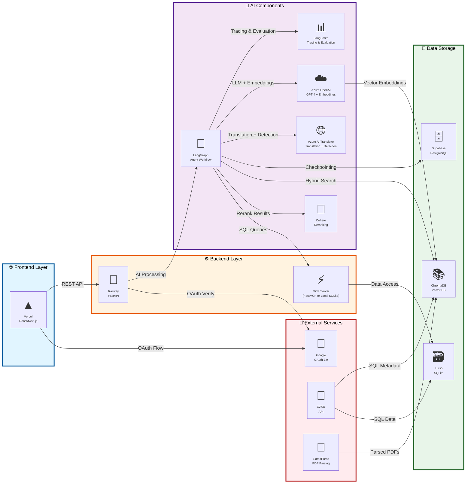

# Architecture Diagram - Version 6 (Final)

```mermaid
graph LR
    %% Frontend Layer
    subgraph Frontend["🌐 Frontend Layer"]
        FE["<div style='font-size:40px'>▲</div><div style='font-size:10px'>Vercel<br/>React/Next.js</div>"]
    end

    %% Backend Layer
    subgraph Backend["⚙️ Backend Layer"]
        BE["<div style='font-size:40px'>🚀</div><div style='font-size:10px'>Railway<br/>FastAPI</div>"]
        MCP["<div style='font-size:40px'>⚡</div><div style='font-size:10px'>MCP Server<br/>(FastMCP or Local SQLite)</div>"]
    end

    %% AI Components
    subgraph AI["🤖 AI Components"]
        LG["<div style='font-size:40px'>🤖</div><div style='font-size:10px'>LangGraph<br/>Agent Workflow</div>"]
        LS["<div style='font-size:40px'>📊</div><div style='font-size:10px'>LangSmith<br/>Tracing & Evaluation</div>"]
        AzureOAI["<div style='font-size:40px'>☁️</div><div style='font-size:10px'>Azure OpenAI<br/>GPT-4 + Embeddings</div>"]
        AzureTrans["<div style='font-size:40px'>🌐</div><div style='font-size:10px'>Azure AI Translator<br/>Translation + Detection</div>"]
        Cohere["<div style='font-size:40px'>🎯</div><div style='font-size:10px'>Cohere<br/>Reranking</div>"]
    end

    %% Data Storage
    subgraph Data["💾 Data Storage"]
        Chroma["<div style='font-size:40px'>📚</div><div style='font-size:10px'>ChromaDB<br/>Vector DB</div>"]
        Supabase["<div style='font-size:40px'>🗄️</div><div style='font-size:10px'>Supabase<br/>PostgreSQL</div>"]
        Turso["<div style='font-size:40px'>🗃️</div><div style='font-size:10px'>Turso<br/>SQLite</div>"]
    end

    %% External Services
    subgraph External["🔌 External Services"]
        Google["<div style='font-size:40px'>🔐</div><div style='font-size:10px'>Google<br/>OAuth 2.0</div>"]
        CZSU["<div style='font-size:40px'>📄</div><div style='font-size:10px'>CZSU<br/>API</div>"]
        LlamaParse["<div style='font-size:40px'>📑</div><div style='font-size:10px'>LlamaParse<br/>PDF Parsing</div>"]
    end

    %% Data Flow Connections
    FE -->|"REST API"| BE
    BE -->|"AI Processing"| LG
    LG -->|"Tracing & Evaluation"| LS
    LG -->|"LLM + Embeddings"| AzureOAI
    LG -->|"Translation + Detection"| AzureTrans
    LG -->|"Checkpointing"| Supabase
    LG -->|"Hybrid Search"| Chroma
    LG -->|"Rerank Results"| Cohere
    LG -->|"SQL Queries"| MCP
    MCP -->|"Data Access"| Turso

    %% Data Ingestion & Embedding
    CZSU -->|"SQL Metadata"| Chroma
    CZSU -->|"SQL Data"| Turso
    LlamaParse -->|"Parsed PDFs"| Chroma
    AzureOAI -->|"Vector Embeddings"| Chroma

    %% Authentication
    FE -->|"OAuth Flow"| Google
    BE -->|"OAuth Verify"| Google

    %% Styling for subgraphs
    classDef frontendStyle fill:#e1f5ff,stroke:#01579b,stroke-width:3px,color:#000
    classDef backendStyle fill:#fff3e0,stroke:#e65100,stroke-width:3px,color:#000
    classDef aiStyle fill:#f3e5f5,stroke:#4a148c,stroke-width:3px,color:#000
    classDef dataStyle fill:#e8f5e9,stroke:#1b5e20,stroke-width:3px,color:#000
    classDef externalStyle fill:#ffebee,stroke:#b71c1c,stroke-width:3px,color:#000

    class Frontend frontendStyle
    class Backend backendStyle
    class AI aiStyle
    class Data dataStyle
    class External externalStyle
```

