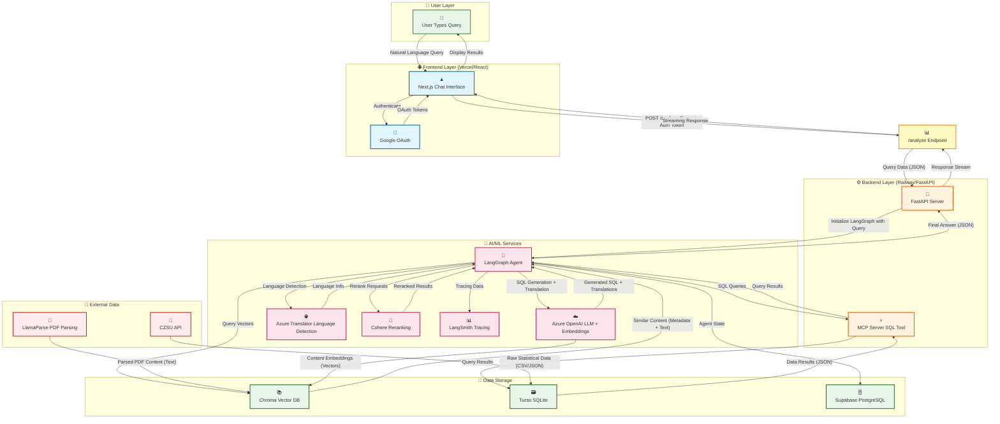

```mermaid
graph TD
    %% User Interaction Layer
    subgraph "👤 User Layer"
        User["👤<br/>User Types Query"]
    end

    %% Frontend Layer
    subgraph "🌐 Frontend Layer (Vercel/React)"
        FE["▲<br/>Next.js Chat Interface"]
        Auth["🔐<br/>Google OAuth"]
    end

    %% Backend Layer
    subgraph "⚙️ Backend Layer (Railway/FastAPI)"
        BE["🚀<br/>FastAPI Server"]
        MCP["⚡<br/>MCP Server SQL Tool"]
    end

    %% Analyze Endpoint (Separate from subgraph to avoid overlap)
    AnalyzeEP["📊<br/>/analyze Endpoint"]

    %% AI/ML Services
    subgraph "🧠 AI/ML Services"
        LangGraph["🤖<br/>LangGraph Agent"]
        AzureOAI["☁️<br/>Azure OpenAI LLM + Embeddings"]
        AzureTrans["🌐<br/>Azure Translator Language Detection"]
        Cohere["🎯<br/>Cohere Reranking"]
        LangSmith["📊<br/>LangSmith Tracing"]
    end

    %% Data Storage Layer
    subgraph "💾 Data Storage"
        Chroma["📚<br/>Chroma Vector DB"]
        Turso["🗃️<br/>Turso SQLite"]
        Supabase["🗄️<br/>Supabase PostgreSQL"]
    end

    %% External Data Sources
    subgraph "🔌 External Data"
        CZSU["📄<br/>CZSU API"]
        LlamaParse["📑<br/>LlamaParse PDF Parsing"]
    end

    %% Main Data Flow - User Query Processing
    User -->|"Natural Language Query"| FE
    FE -->|"Authenticate"| Auth
    Auth -->|"OAuth Tokens"| FE
    FE -->|"POST /analyze Query + Auth Token"| AnalyzeEP
    AnalyzeEP -->|"Query Data (JSON)"| BE
    BE -->|"Initialize LangGraph with Query"| LangGraph

    %% LangGraph Data Flows (Simplified)
    LangGraph -->|"Query Vectors"| Chroma
    Chroma -->|"Similar Content (Metadata + Text)"| LangGraph
    LangGraph -->|"Rerank Requests"| Cohere
    Cohere -->|"Reranked Results"| LangGraph
    LangGraph -->|"SQL Generation + Translation"| AzureOAI
    AzureOAI -->|"Generated SQL + Translations"| LangGraph
    LangGraph -->|"Language Detection"| AzureTrans
    AzureTrans -->|"Language Info"| LangGraph
    LangGraph -->|"SQL Queries"| MCP
    MCP -->|"Query Results"| Turso
    Turso -->|"Data Results (JSON)"| MCP
    MCP -->|"Query Results"| LangGraph
    LangGraph -->|"Agent State"| Supabase
    LangGraph -->|"Tracing Data"| LangSmith

    %% LangGraph Response Flow
    LangGraph -->|"Final Answer (JSON)"| BE
    BE -->|"Response Stream"| AnalyzeEP
    AnalyzeEP -->|"Streaming Response"| FE
    FE -->|"Display Results"| User

    %% Data Ingestion (Offline/Background)
    CZSU -->|"Raw Statistical Data (CSV/JSON)"| Turso
    LlamaParse -->|"Parsed PDF Content (Text)"| Chroma
    AzureOAI -->|"Content Embeddings (Vectors)"| Chroma

    %% Styling
    classDef userLayer fill:#e8f5e9,stroke:#2e7d32,stroke-width:2px
    classDef frontendLayer fill:#e1f5ff,stroke:#01579b,stroke-width:2px
    classDef backendLayer fill:#fff3e0,stroke:#e65100,stroke-width:2px
    classDef agentLayer fill:#f3e5f5,stroke:#7b1fa2,stroke-width:2px
    classDef aiLayer fill:#fce4ec,stroke:#c2185b,stroke-width:2px
    classDef dataLayer fill:#e8f5e9,stroke:#1b5e20,stroke-width:2px
    classDef externalLayer fill:#ffebee,stroke:#b71c1c,stroke-width:2px
    classDef endpoint fill:#fff9c4,stroke:#f57f17,stroke-width:2px

    class User userLayer
    class FE,Auth frontendLayer
    class BE,MCP backendLayer
    class AnalyzeEP endpoint
    class LangGraph,AzureOAI,AzureTrans,Cohere,LangSmith aiLayer
    class Chroma,Turso,Supabase dataLayer
    class CZSU,LlamaParse externalLayer
```