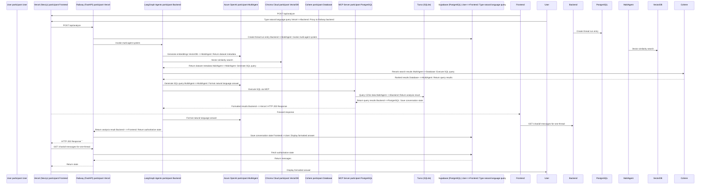

```mermaid

sequenceDiagram

    participant User    participant User

    participant Vercel as Vercel (Next.js)    participant Frontend

    participant Railway as Railway (FastAPI)    participant Vercel

    participant LangGraph as LangGraph Agents    participant Backend

    participant AzureOpenAI as Azure OpenAI    participant MultiAgent

    participant ChromaCloud as Chroma Cloud    participant VectorDB

    participant Cohere    participant Database

    participant MCP as MCP Server    participant PostgreSQL

    participant Turso as Turso (SQLite)

    participant Supabase as Supabase (PostgreSQL)    User->>Frontend: Type natural language query

    Frontend->>Vercel: POST /api/analyze

    User->>Vercel: Type natural language query    Vercel->>Backend: Proxy to Railway backend

    Vercel->>Railway: POST /api/analyze

        Backend->>PostgreSQL: Create thread run entry

    Railway->>Supabase: Create thread run entry    Backend->>MultiAgent: Invoke multi-agent system

    Railway->>LangGraph: Invoke multi-agent system

        MultiAgent->>VectorDB: Vector similarity search

    LangGraph->>AzureOpenAI: Generate embeddings    VectorDB-->>MultiAgent: Return dataset metadata

    LangGraph->>ChromaCloud: Vector similarity search

    ChromaCloud-->>LangGraph: Return dataset metadata    MultiAgent->>MultiAgent: Generate SQL query

    

    LangGraph->>Cohere: Rerank search results    MultiAgent->>Database: Execute SQL query

    Cohere-->>LangGraph: Ranked results    Database-->>MultiAgent: Return query results

    

    LangGraph->>AzureOpenAI: Generate SQL query    MultiAgent->>MultiAgent: Format natural language answer

    LangGraph->>MCP: Execute SQL via MCP

    MCP->>Turso: Query CZSU data    MultiAgent-->>Backend: Return analysis result

    Turso-->>MCP: Return query results    Backend->>PostgreSQL: Save conversation state

    MCP-->>LangGraph: Formatted results    Backend-->>Vercel: HTTP 200 Response

        Vercel-->>Frontend: Forward response

    LangGraph->>AzureOpenAI: Format natural language answer

        Frontend->>Backend: GET /chat/all-messages-for-one-thread

    LangGraph-->>Railway: Return analysis result    Backend-->>Frontend: Return authoritative state

    Railway->>Supabase: Save conversation state    Frontend->>User: Display formatted answer

    Railway-->>Vercel: HTTP 200 Response```
    
    Vercel->>Railway: GET /chat/all-messages-for-one-thread
    Railway->>Supabase: Fetch authoritative state
    Supabase-->>Railway: Return messages
    Railway-->>Vercel: Return state
    Vercel->>User: Display formatted answer
```
