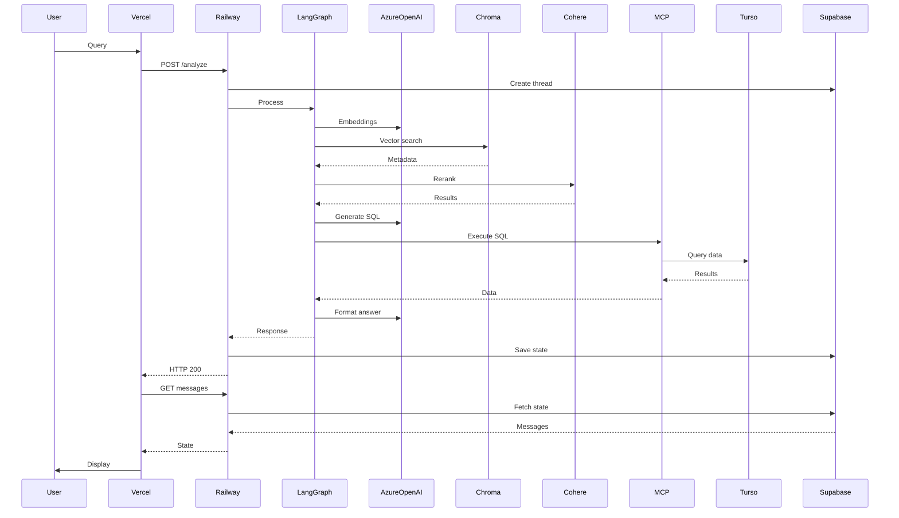

## Key Services
- **Vercel**: Frontend (Next.js)
- **Railway**: Backend (FastAPI)
- **LangGraph**: Multi-agent orchestration
- **Azure OpenAI**: LLM + embeddings
- **Chroma**: Vector database
- **Cohere**: Reranking
- **MCP**: SQL execution
- **Turso**: CZSU data (SQLite)
- **Supabase**: State persistence (PostgreSQL)

## Flow Description
- **User Input**: User types natural language query in Vercel frontend
- **API Request**: Vercel forwards POST /analyze to Railway backend
- **Thread Creation**: Railway creates conversation thread in Supabase
- **Multi-Agent Processing**: LangGraph orchestrates the analysis workflow
- **Vector Search**: Azure OpenAI generates embeddings, Chroma performs semantic search
- **Result Reranking**: Cohere reranks search results for relevance
- **SQL Generation**: Azure OpenAI generates SQL query from natural language
- **Data Execution**: MCP executes SQL against Turso database with CZSU data
- **Answer Formatting**: Azure OpenAI formats results into natural language response
- **State Persistence**: Railway saves conversation state to Supabase
- **Response Delivery**: Results flow back through Railway → Vercel → User
- **UI Synchronization**: Vercel fetches authoritative state from Railway/Supabase
- **Display**: Formatted answer with datasets and follow-ups shown to user