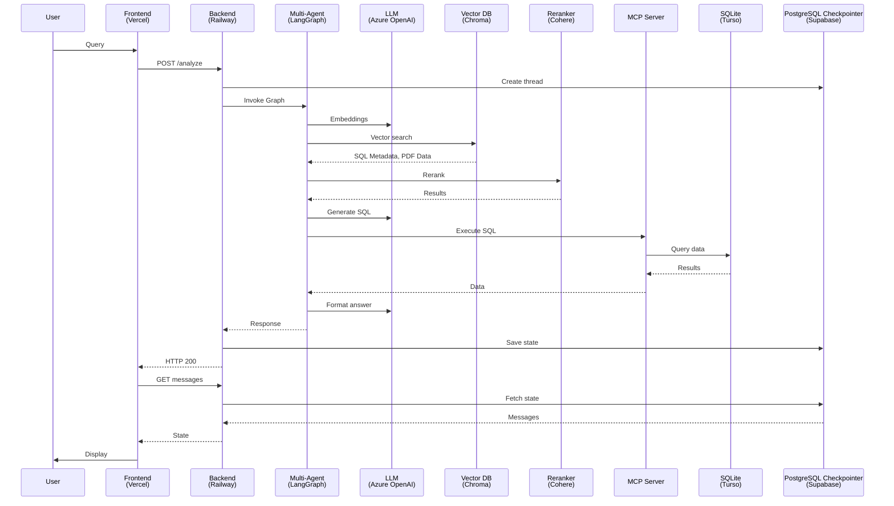

# CZSU Multi-Agent Text-to-SQL - Simplified Flow

## Key Services
- **Frontend (Vercel)**: User interface and API proxy (Next.js)
- **Backend (Railway)**: REST API and orchestration (FastAPI)
- **Multi-Agent (LangGraph)**: Workflow orchestration and agent coordination
- **LLM (Azure OpenAI)**: Language model for embeddings, SQL generation, and answer formatting
- **Vector DB (Chroma)**: Semantic search and dataset discovery
- **Reranker (Cohere)**: Result relevance ranking and filtering
- **MCP Server**: Safe SQL execution against databases
- **SQLite (Turso)**: CZSU statistical data storage
- **PostgreSQL Checkpointer (Supabase)**: Conversation persistence and user sessions

## Flow Description
- **User Input**: User types natural language query in frontend
- **API Request**: Frontend forwards POST /analyze to backend
- **Thread Creation**: Backend creates conversation thread in Supabase
- **Multi-Agent Processing**: Multi-agent system orchestrates the analysis workflow
- **Vector Search**: LLM generates embeddings, vector DB performs semantic search
- **Result Reranking**: Reranker improves search result relevance
- **SQL Generation**: LLM generates SQL query from natural language
- **Data Execution**: MCP server runs query against Turso with CZSU data
- **Answer Formatting**: LLM formats results into natural language response
- **State Persistence**: Backend saves conversation state to Supabase
- **Response Delivery**: Results flow back through backend → frontend → user
- **UI Synchronization**: Frontend fetches authoritative state from backend/Supabase
- **Display**: Formatted answer with datasets and follow-ups shown to user