# Frontend Architecture Diagram

```mermaid
graph TB
    %% Core Framework Layer
    subgraph CoreFramework["⚡ Core Framework"]
        NextJS["<div style='font-size:40px'>▲</div><div style='font-size:10px'>Next.js 15.3<br/>App Router + SSR</div>"]
        React["<div style='font-size:40px'>⚛️</div><div style='font-size:10px'>React 19<br/>Client Components</div>"]
        TS["<div style='font-size:40px'>📘</div><div style='font-size:10px'>TypeScript<br/>Type Safety</div>"]
    end

    %% Routing & Pages Layer
    subgraph Routing["🗺️ Application Routes"]
        AppRouter["<div style='font-size:40px'>🧭</div><div style='font-size:10px'>Next.js App Router<br/>File-based Routing</div>"]
        
        subgraph Pages["Pages"]
            HomePage["<div style='font-size:24px'>🏠</div><div style='font-size:9px'>Home Page<br/>/</div>"]
            ChatPage["<div style='font-size:24px'>💬</div><div style='font-size:9px'>Chat Page<br/>/chat</div>"]
            CatalogPage["<div style='font-size:24px'>📚</div><div style='font-size:9px'>Catalog Page<br/>/catalog</div>"]
            DataPage["<div style='font-size:24px'>📊</div><div style='font-size:9px'>Data Page<br/>/data</div>"]
            ContactsPage["<div style='font-size:24px'>📧</div><div style='font-size:9px'>Contacts Page<br/>/contacts</div>"]
            LoginPage["<div style='font-size:24px'>🔐</div><div style='font-size:9px'>Login Page<br/>/login</div>"]
        end
        
        subgraph APIRoutes["API Routes"]
            AuthAPI["<div style='font-size:24px'>🔑</div><div style='font-size:9px'>NextAuth<br/>/api/auth/*</div>"]
            PlaceholderAPI["<div style='font-size:24px'>🖼️</div><div style='font-size:9px'>Image Placeholder<br/>/api/placeholder/*</div>"]
        end
    end

    %% Layout Components Layer
    subgraph LayoutSystem["🎨 Layout System"]
        RootLayout["<div style='font-size:40px'>📐</div><div style='font-size:10px'>RootLayout<br/>HTML + Body</div>"]
        ClientLayout["<div style='font-size:40px'>🖼️</div><div style='font-size:10px'>ClientLayout<br/>Route Protection</div>"]
        Header["<div style='font-size:40px'>🎯</div><div style='font-size:10px'>Header<br/>Navigation Bar</div>"]
    end

    %% UI Components Layer
    subgraph UIComponents["🧩 UI Components"]
        Auth["<div style='font-size:24px'>🔒</div><div style='font-size:9px'>Auth Components<br/>AuthButton + AuthGuard</div>"]
        Chat["<div style='font-size:24px'>💭</div><div style='font-size:9px'>Chat Components<br/>MessageArea + InputBar</div>"]
        Tables["<div style='font-size:24px'>📋</div><div style='font-size:9px'>Table Components<br/>DatasetsTable + DataTableView</div>"]
        UI["<div style='font-size:24px'>🎛️</div><div style='font-size:9px'>Common UI<br/>Modal + LoadingSpinner</div>"]
    end

    %% State Management Layer
    subgraph StateManagement["💾 State Management"]
        ChatContext["<div style='font-size:40px'>🗂️</div><div style='font-size:10px'>ChatCacheContext<br/>Global Chat State</div>"]
        SessionContext["<div style='font-size:40px'>👤</div><div style='font-size:10px'>SessionProvider<br/>Auth State</div>"]
        LocalState["<div style='font-size:40px'>⚙️</div><div style='font-size:10px'>Component State<br/>useState + useEffect</div>"]
    end

    %% Authentication Layer
    subgraph AuthLayer["🔐 Authentication"]
        NextAuth["<div style='font-size:40px'>🎫</div><div style='font-size:10px'>NextAuth.js<br/>Session Management</div>"]
        OAuth["<div style='font-size:40px'>🔑</div><div style='font-size:10px'>Google OAuth 2.0<br/>ID Token + Access Token</div>"]
    end

    %% Data Persistence Layer
    subgraph Persistence["💽 Data Persistence"]
        LocalStorage["<div style='font-size:40px'>📦</div><div style='font-size:10px'>LocalStorage<br/>Cache + Session Data</div>"]
        IndexedDB["<div style='font-size:40px'>🗄️</div><div style='font-size:10px'>IndexedDB (idb)<br/>Large Data Storage</div>"]
    end

    %% Styling Layer
    subgraph StylingLayer["🎨 Styling"]
        Tailwind["<div style='font-size:40px'>🌊</div><div style='font-size:10px'>Tailwind CSS 4<br/>Utility-First Styling</div>"]
        GlobalCSS["<div style='font-size:40px'>🎭</div><div style='font-size:10px'>Global CSS<br/>Custom Styles</div>"]
    end

    %% API Communication Layer
    subgraph APILayer["🌐 API Communication"]
        APIUtils["<div style='font-size:40px'>🔧</div><div style='font-size:10px'>API Utilities<br/>api.ts</div>"]
        AuthFetch["<div style='font-size:40px'>🔐</div><div style='font-size:10px'>authApiFetch<br/>Token Refresh + Retry</div>"]
        Endpoints["<div style='font-size:40px'>🎯</div><div style='font-size:10px'>Backend Endpoints<br/>/analyze, /chat, /chat-threads</div>"]
    end

    %% External Services
    subgraph ExternalServices["🔌 External Services"]
        Backend["<div style='font-size:40px'>🚀</div><div style='font-size:10px'>FastAPI Backend<br/>Railway/Vercel</div>"]
        GoogleAuth["<div style='font-size:40px'>🔐</div><div style='font-size:10px'>Google<br/>OAuth Provider</div>"]
        Vercel["<div style='font-size:40px'>▲</div><div style='font-size:10px'>Vercel<br/>Hosting + Edge Network</div>"]
    end

    %% Core Framework Connections
    NextJS --> React
    NextJS --> TS
    React --> TS

    %% Routing Connections
    NextJS --> AppRouter
    AppRouter --> Pages
    AppRouter --> APIRoutes
    
    Pages --> HomePage
    Pages --> ChatPage
    Pages --> CatalogPage
    Pages --> DataPage
    Pages --> ContactsPage
    Pages --> LoginPage
    
    APIRoutes --> AuthAPI
    APIRoutes --> PlaceholderAPI

    %% Layout Connections
    RootLayout --> ClientLayout
    RootLayout --> Header
    ClientLayout --> Pages
    Header --> Pages

    %% Component Connections
    Pages --> UIComponents
    UIComponents --> Auth
    UIComponents --> Chat
    UIComponents --> Tables
    UIComponents --> UI
    
    ChatPage --> Chat
    CatalogPage --> Tables
    DataPage --> Tables

    %% State Management Connections
    ClientLayout --> ChatContext
    ClientLayout --> SessionContext
    UIComponents --> LocalState
    ChatContext --> LocalStorage
    SessionContext --> NextAuth

    %% Authentication Connections
    Auth --> NextAuth
    NextAuth --> OAuth
    AuthAPI --> NextAuth
    SessionContext --> NextAuth
    NextAuth --> GoogleAuth

    %% Data Persistence Connections
    ChatContext --> LocalStorage
    ChatContext --> IndexedDB
    DataPage --> LocalStorage

    %% Styling Connections
    UIComponents --> Tailwind
    UIComponents --> GlobalCSS
    RootLayout --> GlobalCSS

    %% API Communication Connections
    ChatPage --> APIUtils
    CatalogPage --> APIUtils
    DataPage --> APIUtils
    APIUtils --> AuthFetch
    AuthFetch --> Endpoints
    AuthFetch --> SessionContext
    Endpoints --> Backend

    %% External Services Connections
    NextJS --> Vercel
    Backend --> Vercel
    OAuth --> GoogleAuth

    %% Cross-layer Connections
    AuthFetch -.->|"401 Retry"| NextAuth
    ChatContext -.->|"Cross-tab Sync"| LocalStorage
    APIUtils -.->|"Token Refresh"| SessionContext

    %% Styling for subgraphs
    classDef frameworkStyle fill:#1e293b,stroke:#0ea5e9,stroke-width:3px,color:#fff
    classDef routingStyle fill:#fef3c7,stroke:#f59e0b,stroke-width:3px,color:#000
    classDef layoutStyle fill:#dbeafe,stroke:#3b82f6,stroke-width:3px,color:#000
    classDef componentStyle fill:#e0e7ff,stroke:#6366f1,stroke-width:3px,color:#000
    classDef stateStyle fill:#fce7f3,stroke:#ec4899,stroke-width:3px,color:#000
    classDef authStyle fill:#fef2f2,stroke:#ef4444,stroke-width:3px,color:#000
    classDef persistenceStyle fill:#d1fae5,stroke:#10b981,stroke-width:3px,color:#000
    classDef stylingStyle fill:#f3e8ff,stroke:#a855f7,stroke-width:3px,color:#000
    classDef apiStyle fill:#cffafe,stroke:#06b6d4,stroke-width:3px,color:#000
    classDef externalStyle fill:#ffedd5,stroke:#f97316,stroke-width:3px,color:#000

    class CoreFramework frameworkStyle
    class Routing routingStyle
    class LayoutSystem layoutStyle
    class UIComponents componentStyle
    class StateManagement stateStyle
    class AuthLayer authStyle
    class Persistence persistenceStyle
    class StylingLayer stylingStyle
    class APILayer apiStyle
    class ExternalServices externalStyle
```



## Architecture Overview

### 🏗️ Key Architectural Patterns

1. **Component-Based Architecture**: React components organized by feature and reusability
2. **Layered Architecture**: Clear separation between routing, layout, UI, state, and services
3. **Context Pattern**: Global state management using React Context API
4. **Repository Pattern**: Centralized API communication via `api.ts`
5. **Protected Route Pattern**: Authentication guards on private routes
6. **Token Refresh Pattern**: Automatic token refresh on 401 responses

### 📋 Core Features

#### 1. **Routing & Navigation**
- File-based routing using Next.js App Router
- Server and client components separation
- Dynamic route parameters for flexible navigation
- API routes for server-side endpoints

#### 2. **State Management**
- **ChatCacheContext**: Manages chat threads, messages, pagination
  - LocalStorage persistence for offline support
  - Cross-tab synchronization for consistent state
  - Optimistic updates for better UX
- **SessionProvider**: Manages authentication state
  - Token refresh mechanism
  - Session persistence across page reloads

#### 3. **Authentication Flow**
- Google OAuth 2.0 integration via NextAuth
- Protected routes with AuthGuard component
- Automatic token refresh on expiry
- Session state synchronization

#### 4. **Data Flow**
```
User Action → Component → Context/State → API Utils → Backend
     ↓                                                      ↓
  UI Update ← Component ← Context Update ← Response ← Backend
```

#### 5. **Caching Strategy**
- **Hot Data**: ChatCacheContext (in-memory)
- **Warm Data**: LocalStorage (48-hour cache)
- **Cold Data**: IndexedDB (large datasets)
- **Pagination**: Incremental loading (10 threads per page)

#### 6. **Performance Optimizations**
- Lazy loading of components with Suspense
- Pagination for large data sets (threads, messages)
- Debounced search inputs
- Memoized expensive computations
- Automatic code splitting via Next.js

### 🔄 Data Flow Patterns

#### Chat Message Flow:
1. User enters message in `InputBar`
2. Message sent via `authApiFetch` to backend `/analyze`
3. Optimistic update in `ChatCacheContext`
4. Backend processes with LangGraph agent
5. Response received and cached
6. UI updates via `MessageArea`

#### Authentication Flow:
1. User clicks login in `AuthButton`
2. Redirected to Google OAuth
3. NextAuth handles callback
4. Session created and stored
5. Protected routes become accessible
6. Token auto-refreshes on expiry

#### Data Persistence Flow:
1. State changes in `ChatCacheContext`
2. Automatic save to LocalStorage
3. Cross-tab synchronization via storage events
4. Page refresh loads from LocalStorage
5. Stale data triggers API refresh

### 🎯 Component Hierarchy

```
RootLayout (Server)
└── SessionProviderWrapper (Client)
    └── ClientLayout (Client)
        ├── Header
        │   ├── Navigation Links
        │   └── AuthButton
        └── Pages
            ├── ChatPage
            │   ├── Sidebar (Thread List)
            │   ├── MessageArea
            │   ├── InputBar
            │   └── FollowupPrompts
            ├── CatalogPage
            │   └── DatasetsTable
            ├── DataPage
            │   └── DataTableView
            └── Other Pages
```

### 📦 Technology Stack Summary

| Layer | Technologies |
|-------|-------------|
| **Framework** | Next.js 15.3, React 19, TypeScript |
| **Styling** | Tailwind CSS 4, Custom CSS |
| **Authentication** | NextAuth, Google OAuth 2.0 |
| **State Management** | React Context API, useState/useEffect |
| **Data Persistence** | LocalStorage, IndexedDB (idb) |
| **API Communication** | Fetch API, Custom authApiFetch wrapper |
| **Utilities** | uuid, markdown-to-jsx |
| **Deployment** | Vercel Edge Network |

### 🔐 Security Measures

1. **Token Management**: Automatic refresh on 401 responses
2. **Route Protection**: AuthGuard wraps protected pages
3. **CSRF Protection**: NextAuth built-in protection
4. **Secure Storage**: Sensitive data never in LocalStorage
5. **HTTPS Only**: All communication over secure channels

### 🚀 Deployment Architecture

```
User Browser
    ↓
Vercel Edge Network (CDN)
    ↓
Next.js Frontend (Vercel Serverless)
    ↓ (via /api proxy)
FastAPI Backend (Railway/Vercel)
```

---

**Note**: This diagram represents the current frontend architecture as of the implementation. The architecture follows modern React and Next.js best practices with emphasis on performance, security, and user experience.

