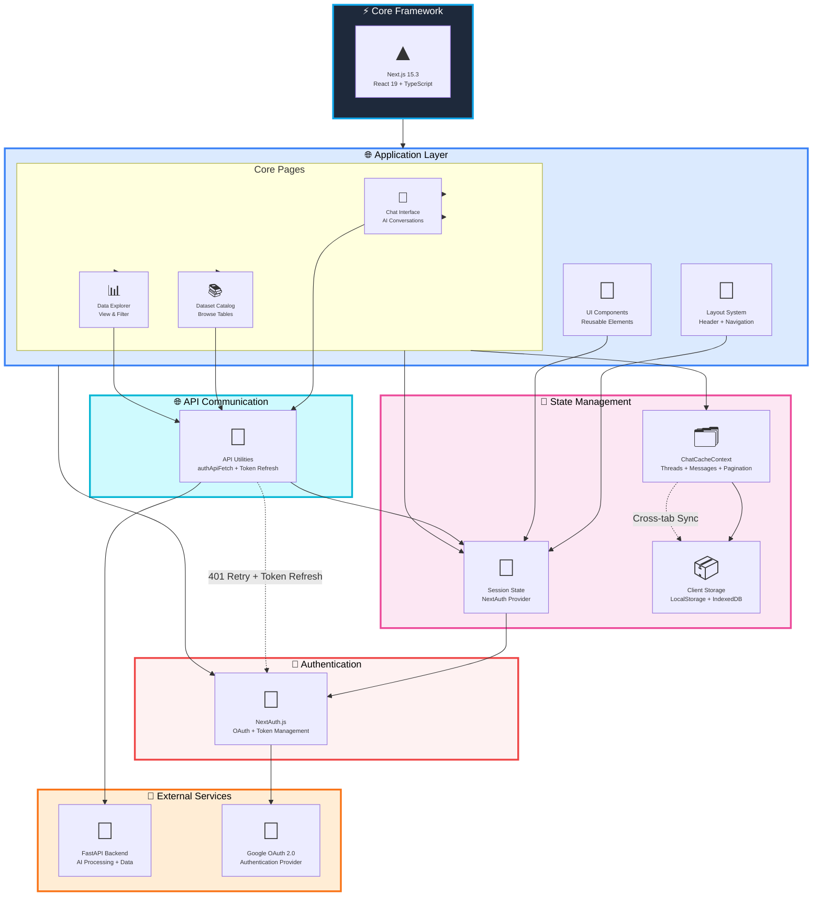

# Frontend Architecture Diagram - Version 2 (Simplified)



## Simplified Architecture Overview

### 🎯 Core Layers (6 Total)

1. **⚡ Core Framework**: Next.js 15 with React 19 and TypeScript
2. **🌐 Application Layer**: Pages, Layout, and UI Components
3. **💾 State Management**: Chat cache, Session, and Client storage
4. **🔐 Authentication**: NextAuth with Google OAuth
5. **🌐 API Communication**: Centralized API utilities with token refresh
6. **🔌 External Services**: Backend and Google OAuth provider

### 🔄 Key Data Flows

#### 1. User Interaction Flow
```
User → Page Component → State Management → API Utils → Backend
```

#### 2. Authentication Flow
```
User → NextAuth → Google OAuth → Session State → Protected Pages
```

#### 3. Chat Flow
```
Chat Page → ChatCacheContext → API Utils → Backend → Cache Update → UI Render
```

### 💡 Key Architectural Decisions

1. **Centralized State**: ChatCacheContext manages all chat-related data with persistence
2. **Token Management**: Automatic token refresh on 401 responses
3. **Client-Side Caching**: LocalStorage for fast access, IndexedDB for large data
4. **Protected Routes**: NextAuth guards all sensitive pages
5. **Pagination**: Incremental loading for better performance

### 📊 Technology Stack

| Layer | Technology |
|-------|-----------|
| Framework | Next.js 15, React 19, TypeScript |
| Auth | NextAuth, Google OAuth 2.0 |
| State | React Context API, LocalStorage |
| Styling | Tailwind CSS 4 |
| API | Fetch with custom wrapper |

### 🚀 Deployment

```
Vercel Edge Network
    ↓
Next.js Frontend
    ↓
FastAPI Backend (Railway)
```

---

**Version 2 Changes**: Simplified from 10 layers to 6 core layers, removed implementation details, focused on essential architecture and data flow patterns.

