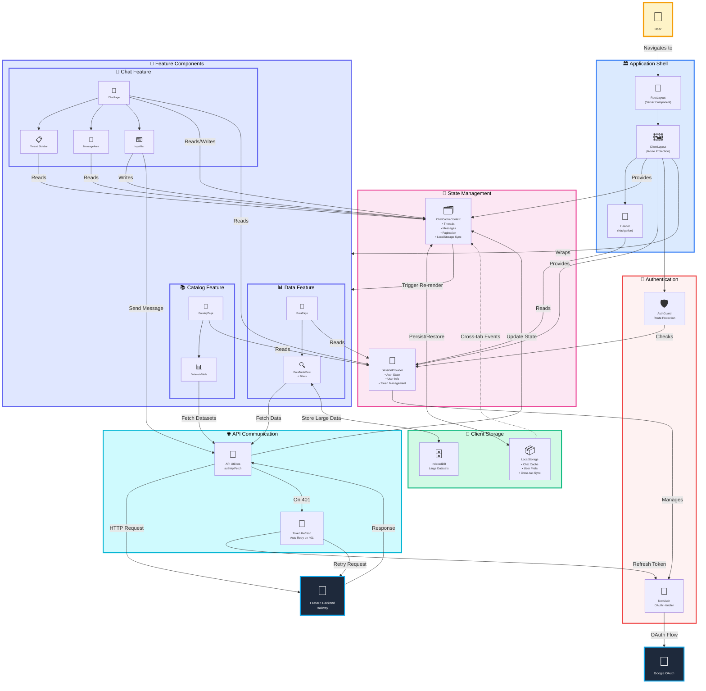

# Frontend Architecture Diagram - Version 3 (Component-Interaction Focused)



## Architecture Overview

### 🎯 Core Architectural Components

#### 1. **Application Shell** (Entry Point)
- **RootLayout**: Server-side rendered HTML structure
- **ClientLayout**: Client-side route protection and state providers
- **Header**: Global navigation component

#### 2. **State Management** (Single Source of Truth)
- **ChatCacheContext**: 
  - Manages all chat-related data (threads, messages, pagination)
  - Persists to LocalStorage with cross-tab synchronization
  - Provides optimistic updates for instant UI feedback
- **SessionProvider**:
  - Manages authentication state
  - Provides user information to all components
  - Handles token lifecycle

#### 3. **Feature Components** (Business Logic)
- **Chat Feature**: 
  - Sidebar displays thread list from ChatCache
  - MessageArea renders messages from ChatCache
  - InputBar sends messages via API and updates ChatCache
- **Catalog Feature**:
  - Displays browsable dataset catalog
  - Fetches data via API utilities
- **Data Feature**:
  - Table view with filtering capabilities
  - Uses IndexedDB for large dataset storage

#### 4. **API Communication** (Backend Integration)
- **API Utilities**: Centralized HTTP request handling
- **Token Refresh**: Automatic retry mechanism on authentication failures
- Handles all backend communication with error recovery

#### 5. **Authentication System** (Security)
- **NextAuth**: OAuth 2.0 flow handler
- **AuthGuard**: Protects routes from unauthorized access
- Integrated with SessionProvider for state management

#### 6. **Client Storage** (Performance)
- **LocalStorage**: Fast access for cache and preferences
- **IndexedDB**: Large dataset storage without memory pressure
- Cross-tab synchronization for consistent state

### 🔄 Key Interaction Patterns

#### Message Send Flow:
```
User types message
    ↓
InputBar captures input
    ↓
InputBar calls APIUtils.authApiFetch('/analyze')
    ↓
APIUtils sends to Backend with auth token
    ↓ (if 401)
TokenRefresh gets new token → Retry request
    ↓
Backend returns response
    ↓
ChatCache updates with new message
    ↓
MessageArea re-renders with new data
```

#### Authentication Flow:
```
User navigates to protected route
    ↓
AuthGuard checks SessionProvider
    ↓ (if not authenticated)
Redirect to NextAuth login
    ↓
NextAuth redirects to Google OAuth
    ↓
Google returns with tokens
    ↓
NextAuth creates session
    ↓
SessionProvider updates state
    ↓
User redirected to protected route
```

#### Cache Persistence Flow:
```
ChatCache state changes
    ↓
useEffect triggers save to LocalStorage
    ↓
Other browser tabs receive storage event
    ↓
Other tabs' ChatCache syncs with new data
    ↓
All tabs show consistent state
```

### 🏗️ Architectural Principles

1. **Unidirectional Data Flow**: State flows down, events flow up
2. **Single Source of Truth**: ChatCacheContext is authoritative for chat data
3. **Separation of Concerns**: Components, state, API, and auth are independent
4. **Error Recovery**: Automatic token refresh and retry on failures
5. **Performance**: LocalStorage + IndexedDB for fast access and large data
6. **Consistency**: Cross-tab synchronization ensures consistent state

### 📊 Component Communication Matrix

| Component | Reads From | Writes To | Communicates With |
|-----------|-----------|-----------|-------------------|
| InputBar | SessionProvider | ChatCache, API | Backend |
| MessageArea | ChatCache | - | - |
| Sidebar | ChatCache | ChatCache | - |
| ChatCache | LocalStorage | LocalStorage | - |
| APIUtils | SessionProvider | - | Backend, TokenRefresh |
| AuthGuard | SessionProvider | - | NextAuth |

---

**Version 3 Focus**: Component-based architecture showing actual components, their relationships, data flow patterns, and interaction mechanisms. Emphasizes HOW components work together rather than WHAT layers exist.

