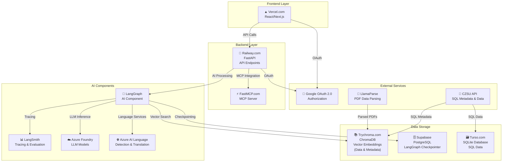

```mermaid
graph TD
    %% Frontend Layer
    subgraph Frontend["Frontend Layer"]
        FE["▲ Vercel.com<br/>React/Next.js"]
    end

    %% Backend Layer
    subgraph Backend["Backend Layer"]
        BE["🚀 Railway.com<br/>FastAPI<br/>API Endpoints"]
        MCP["⚡ FastMCP.com<br/>MCP Server"]
    end

    %% AI Layer
    subgraph AI["AI Components"]
        LG["🤖 LangGraph<br/>AI Component"]
        LS["📊 LangSmith<br/>Tracing & Evaluation"]
        AzureLLM["☁️ Azure Foundry<br/>LLM Models"]
        AzureAI["🌐 Azure AI Language<br/>Detection & Translation"]
    end

    %% Data Layer
    subgraph Data["Data Storage"]
        Chroma["📚 Trychroma.com<br/>ChromaDB<br/>Vector Embeddings<br/>(Data & Metadata)"]
        Supabase["🗄️ Supabase<br/>PostgreSQL<br/>LangGraph Checkpointer"]
        Turso["🗃️ Turso.com<br/>SQLite Database<br/>SQL Data"]
    end

    %% External Services
    subgraph External["External Services"]
        Google["🔐 Google OAuth 2.0<br/>Authorization"]
        CZSU["📄 CZSU API<br/>SQL Metadata & Data"]
        LlamaParse["📑 LlamaParse<br/>PDF Data Parsing"]
    end

    %% Data Flow Connections
    FE -->|"API Calls"| BE
    BE -->|"AI Processing"| LG
    LG -->|"Tracing"| LS
    LG -->|"LLM Inference"| AzureLLM
    LG -->|"Language Services"| AzureAI
    LG -->|"Checkpointing"| Supabase
    LG -->|"Vector Search"| Chroma
    BE -->|"MCP Integration"| MCP

    %% Data Ingestion
    CZSU -->|"SQL Metadata"| Chroma
    CZSU -->|"SQL Data"| Turso
    LlamaParse -->|"Parsed PDFs"| Chroma

    %% Authentication
    FE -->|"OAuth"| Google
    BE -->|"OAuth"| Google
```