```mermaid
graph LR
    %% Frontend Layer
    subgraph Frontend["🌐 Frontend Layer"]
        FE["<div style='font-size:40px'>▲</div><div style='font-size:10px'>Vercel<br/>React/Next.js</div>"]
    end

    %% Backend Layer
    subgraph Backend["⚙️ Backend Layer"]
        BE["<div style='font-size:40px'>🚀</div><div style='font-size:10px'>Railway<br/>FastAPI</div>"]
        MCP["<div style='font-size:40px'>⚡</div><div style='font-size:10px'>MCP Server<br/>(FastMCP or Local SQLite)</div>"]
    end

    %% AI Components
    subgraph AI["🤖 AI Components"]
        LG["<div style='font-size:40px'>🤖</div><div style='font-size:10px'>LangGraph<br/>Agent Workflow</div>"]
        LS["<div style='font-size:40px'>📊</div><div style='font-size:10px'>LangSmith<br/>Tracing</div>"]
        AzureOAI["<div style='font-size:40px'>☁️</div><div style='font-size:10px'>Azure OpenAI<br/>GPT-4o + Embeddings</div>"]
        AzureTrans["<div style='font-size:40px'>🌐</div><div style='font-size:10px'>Azure AI Translator<br/>Translation + Language Detection</div>"]
        Cohere["<div style='font-size:40px'>🎯</div><div style='font-size:10px'>Cohere<br/>Reranking</div>"]
    end

    %% Data Storage
    subgraph Data["💾 Data Storage"]
        Chroma["<div style='font-size:40px'>📚</div><div style='font-size:10px'>ChromaDB<br/>Vector DB</div>"]
        Supabase["<div style='font-size:40px'>🗄️</div><div style='font-size:10px'>Supabase<br/>PostgreSQL</div>"]
        Turso["<div style='font-size:40px'>🗃️</div><div style='font-size:10px'>Turso<br/>SQLite</div>"]
    end

    %% External Services
    subgraph External["🔌 External Services"]
        Google["<div style='font-size:40px'>🔐</div><div style='font-size:10px'>Google<br/>OAuth 2.0</div>"]
        CZSU["<div style='font-size:40px'>📄</div><div style='font-size:10px'>CZSU<br/>API</div>"]
        PDFParse["<div style='font-size:40px'>📑</div><div style='font-size:10px'>PDF Parsing<br/>LlamaParse or Azure DI</div>"]
    end

    %% Data Flow Connections
    FE -->|"API Calls"| BE
    BE -->|"AI Processing"| LG
    LG -->|"Tracing"| LS
    LG -->|"LLM + Embeddings"| AzureOAI
    LG -->|"Translation + Detection"| AzureTrans
    LG -->|"Checkpointing"| Supabase
    LG -->|"Hybrid Search"| Chroma
    LG -->|"Rerank Results"| Cohere
    BE -->|"SQL Queries"| MCP
    MCP -->|"Data Access"| Turso

    %% Data Ingestion & Embedding
    CZSU -->|"SQL Metadata"| Chroma
    CZSU -->|"SQL Data"| Turso
    PDFParse -->|"Parsed PDFs"| Chroma
    AzureOAI -->|"Vector Embeddings"| Chroma

    %% Authentication
    FE -->|"OAuth Flow"| Google
    BE -->|"OAuth Verify"| Google

    %% Styling for subgraphs
    classDef frontendStyle fill:#e1f5ff,stroke:#01579b,stroke-width:3px,color:#000
    classDef backendStyle fill:#fff3e0,stroke:#e65100,stroke-width:3px,color:#000
    classDef aiStyle fill:#f3e5f5,stroke:#4a148c,stroke-width:3px,color:#000
    classDef dataStyle fill:#e8f5e9,stroke:#1b5e20,stroke-width:3px,color:#000
    classDef externalStyle fill:#ffebee,stroke:#b71c1c,stroke-width:3px,color:#000

    class Frontend frontendStyle
    class Backend backendStyle
    class AI aiStyle
    class Data dataStyle
    class External externalStyle
```

# Corrected Architecture Diagram (Version 4)

**Changes from Version 3:**
- ✅ Fixed: Azure services correctly represented as single services with multiple capabilities
- ✅ "Azure OpenAI" shown as ONE service (not split into LLM and Embeddings)
- ✅ "Azure AI Translator" shown as ONE service (handles both translation and language detection)
- ✅ Updated service descriptions to show capabilities

---



---

## Key Corrections (Version 4)

### ✅ **Critical Fixes Applied:**

#### 1. **Azure OpenAI Service** (Correctly Unified)
**Before (V3 - WRONG):**
- ☁️ Azure OpenAI - GPT-4o/4o-mini
- 🧮 Azure OpenAI - Embeddings (text-embedding-3-large)

**After (V4 - CORRECT):**
- ☁️ **Azure OpenAI Service** - GPT-4o + Embeddings

**Reason:** Azure OpenAI is **ONE service** that provides multiple model types:
- GPT models (gpt-4o, gpt-4o-mini) for chat/completion
- Embedding models (text-embedding-3-large) for vector generation
- Both use the same endpoint: `AZURE_OPENAI_ENDPOINT`
- Both use the same API key: `AZURE_OPENAI_API_KEY`

#### 2. **Azure AI Translator** (Correctly Unified)
**Before (V2 - WRONG):**
- "Azure AI Language"

**Before (V3 - PARTIALLY WRONG):**
- "Azure Translator - Language Detection"

**After (V4 - CORRECT):**
- 🌐 **Azure AI Translator** - Translation + Language Detection

**Reason:** Azure AI Translator is **ONE service** that provides:
- Text translation across 100+ languages (`/translate` API)
- Language detection (`/detect` API)
- Both use the same credentials: `TRANSLATOR_TEXT_SUBSCRIPTION_KEY`, `TRANSLATOR_TEXT_REGION`, `TRANSLATOR_TEXT_ENDPOINT`

---

## Service Details

### Azure Services Used (Correct Naming)

| Service | Official Name | What You Use | Models/Features |
|---------|--------------|--------------|-----------------|
| **LLM + Embeddings** | **Azure OpenAI Service** | ✅ Single service | GPT-4o, GPT-4o-mini, text-embedding-3-large |
| **Translation + Detection** | **Azure AI Translator** | ✅ Single service | Translation API, Language Detection API |

### Code Evidence

**Azure OpenAI Service (One Service):**
```python
# From my_agent/utils/models.py
# Same endpoint and key for both GPT and embeddings:

# GPT models
AzureChatOpenAI(
    deployment_name="gpt-4o__test1",
    azure_endpoint=os.getenv("AZURE_OPENAI_ENDPOINT"),
    api_key=os.getenv("AZURE_OPENAI_API_KEY")
)

# Embedding models
AzureOpenAI(
    azure_endpoint=os.getenv("AZURE_OPENAI_ENDPOINT"),
    api_key=os.getenv("AZURE_OPENAI_API_KEY")
)
# Using deployment: "text-embedding-3-large__test1"
```

**Azure AI Translator (One Service):**
```python
# From my_agent/utils/helpers.py
# Same credentials for both translation and detection:

# Translation
endpoint = os.environ["TRANSLATOR_TEXT_ENDPOINT"]
subscription_key = os.environ["TRANSLATOR_TEXT_SUBSCRIPTION_KEY"]
region = os.environ["TRANSLATOR_TEXT_REGION"]
path = "/translate?api-version=3.0&to=en"

# Language Detection
endpoint = os.environ["TRANSLATOR_TEXT_ENDPOINT"]
subscription_key = os.environ["TRANSLATOR_TEXT_SUBSCRIPTION_KEY"]
region = os.environ["TRANSLATOR_TEXT_REGION"]
path = "/detect?api-version=3.0"
```

---

## Updated Service Count

**Total Services:** 14 (not 15)

**AI Components (Updated):**
1. LangGraph - Agent Workflow
2. LangSmith - Tracing & Evaluation
3. **Azure OpenAI Service** - GPT + Embeddings ⭐ CORRECTED (was 2, now 1)
4. **Azure AI Translator** - Translation + Detection ⭐ CORRECTED
5. Cohere - Multilingual Reranking

---

## Comparison: V2 vs V3 vs V4

| Service | V2 (Original) | V3 (First Fix) | V4 (Corrected) |
|---------|---------------|----------------|----------------|
| **Azure LLM** | "Azure Foundry" ❌ | "Azure OpenAI (GPT)" ⚠️ | "Azure OpenAI Service" ✅ |
| **Azure Embeddings** | Not shown ❌ | "Azure OpenAI (Embed)" ⚠️ | Merged into above ✅ |
| **Azure Translation** | "Azure AI Language" ⚠️ | "Azure Translator" ⚠️ | "Azure AI Translator" ✅ |
| **Cohere** | Not shown ❌ | Added ✅ | Kept ✅ |

### Why V4 is Correct

**V3 Problem:** Split Azure OpenAI into 2 separate nodes
- This is **architecturally incorrect** - it's ONE Azure service
- Would confuse people about credentials and endpoints
- Not how Azure actually structures these services

**V4 Solution:** Show Azure OpenAI as ONE service with multiple capabilities
- ✅ Matches how Azure structures the service
- ✅ Matches how you configure it (one endpoint, one key)
- ✅ Clearer and more accurate

---

## Official Azure Documentation References

1. **Azure OpenAI Service:**
   - Official page: https://azure.microsoft.com/en-us/products/ai-services/openai-service
   - Models: GPT-4, GPT-3.5, Embeddings (text-embedding-ada-002, text-embedding-3-large)
   - **One service, multiple model types**

2. **Azure AI Translator:**
   - Official page: https://azure.microsoft.com/en-us/products/ai-services/ai-translator
   - Features: Translation, Language Detection, Transliteration
   - **One service, multiple APIs**

---

## Usage Notes

### For Documentation
Use this version (V4) for all official documentation because it:
- ✅ Uses correct Azure service names
- ✅ Accurately represents service architecture
- ✅ Matches your actual implementation
- ✅ Aligns with Azure's official documentation

### Service Descriptions
When referring to these services in docs:

**Correct:**
- "We use **Azure OpenAI Service** for both LLM inference (GPT-4o) and embeddings (text-embedding-3-large)"
- "We use **Azure AI Translator** for language detection and translation"

**Incorrect:**
- ❌ "We use Azure OpenAI for LLMs and a separate Azure OpenAI for embeddings"
- ❌ "We use Azure Foundry"
- ❌ "We use Azure AI Language for translation"

---

**Version:** 4.0 (Corrected)  
**Last Updated:** November 4, 2025  
**Status:** ✅ Verified Correct - Ready for Production  
**Validated Against:** Azure official documentation + Your codebase

