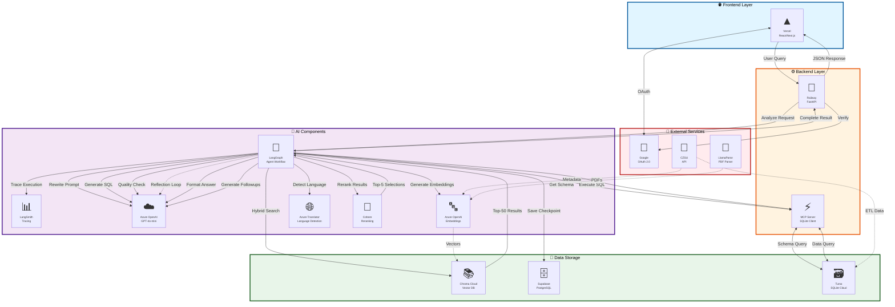

```mermaid
graph TB
    subgraph Frontend["🌐 Frontend Layer"]
        FE["<div style='font-size:40px'>▲</div><div style='font-size:10px'>Vercel<br/>React/Next.js</div>"]
    end

    subgraph Backend["⚙️ Backend Layer"]
        BE["<div style='font-size:40px'>🚀</div><div style='font-size:10px'>Railway<br/>FastAPI</div>"]
        MCP["<div style='font-size:40px'>⚡</div><div style='font-size:10px'>MCP Server<br/>SQLite Client</div>"]
    end

    subgraph AI["🤖 AI Components"]
        LG["<div style='font-size:40px'>🤖</div><div style='font-size:10px'>LangGraph<br/>Agent Workflow</div>"]
        LS["<div style='font-size:40px'>📊</div><div style='font-size:10px'>LangSmith<br/>Tracing</div>"]
        AzureOAI["<div style='font-size:40px'>☁️</div><div style='font-size:10px'>Azure OpenAI<br/>GPT-4o-mini</div>"]
        AzureEmbed["<div style='font-size:40px'>🔤</div><div style='font-size:10px'>Azure OpenAI<br/>Embeddings</div>"]
        AzureTrans["<div style='font-size:40px'>🌐</div><div style='font-size:10px'>Azure Translator<br/>Language Detection</div>"]
        Cohere["<div style='font-size:40px'>🎯</div><div style='font-size:10px'>Cohere<br/>Reranking</div>"]
    end

    subgraph Data["💾 Data Storage"]
        Chroma["<div style='font-size:40px'>📚</div><div style='font-size:10px'>Chroma Cloud<br/>Vector DB</div>"]
        Supabase["<div style='font-size:40px'>🗄️</div><div style='font-size:10px'>Supabase<br/>PostgreSQL</div>"]
        Turso["<div style='font-size:40px'>🗃️</div><div style='font-size:10px'>Turso<br/>SQLite Cloud</div>"]
    end

    subgraph External["🔌 External Services"]
        Google["<div style='font-size:40px'>🔐</div><div style='font-size:10px'>Google<br/>OAuth 2.0</div>"]
        CZSU["<div style='font-size:40px'>📄</div><div style='font-size:10px'>CZSU<br/>API</div>"]
        LlamaParse["<div style='font-size:40px'>📑</div><div style='font-size:10px'>LlamaParse<br/>PDF Parser</div>"]
    end

    FE -->|"User Query"| BE
    BE -->|"Analyze Request"| LG
    
    LG -->|"Trace Execution"| LS
    LG -->|"Rewrite Prompt"| AzureOAI
    LG -->|"Generate Embeddings"| AzureEmbed
    LG -->|"Detect Language"| AzureTrans
    
    LG -->|"Hybrid Search"| Chroma
    Chroma -->|"Top-50 Results"| LG
    LG -->|"Rerank Results"| Cohere
    Cohere -->|"Top-5 Selections"| LG
    
    LG -->|"Get Schema"| MCP
    MCP <-->|"Schema Query"| Turso
    
    LG -->|"Generate SQL"| AzureOAI
    LG -->|"Execute SQL"| MCP
    MCP <-->|"Data Query"| Turso
    
    LG -->|"Quality Check"| AzureOAI
    LG -.->|"Reflection Loop"| AzureOAI
    
    LG -->|"Format Answer"| AzureOAI
    LG -->|"Generate Followups"| AzureOAI
    LG -->|"Save Checkpoint"| Supabase
    
    LG -->|"Complete Result"| BE
    BE -->|"JSON Response"| FE
    
    FE <-->|"OAuth"| Google
    BE -->|"Verify"| Google
    
    CZSU -.->|"ETL Data"| Turso
    CZSU -.->|"Metadata"| AzureEmbed
    AzureEmbed -.->|"Vectors"| Chroma
    LlamaParse -.->|"PDFs"| AzureEmbed

    classDef frontendStyle fill:#e1f5ff,stroke:#01579b,stroke-width:3px,color:#000
    classDef backendStyle fill:#fff3e0,stroke:#e65100,stroke-width:3px,color:#000
    classDef aiStyle fill:#f3e5f5,stroke:#4a148c,stroke-width:3px,color:#000
    classDef dataStyle fill:#e8f5e9,stroke:#1b5e20,stroke-width:3px,color:#000
    classDef externalStyle fill:#ffebee,stroke:#b71c1c,stroke-width:3px,color:#000

    class Frontend frontendStyle
    class Backend backendStyle
    class AI aiStyle
    class Data dataStyle
    class External externalStyle
```
