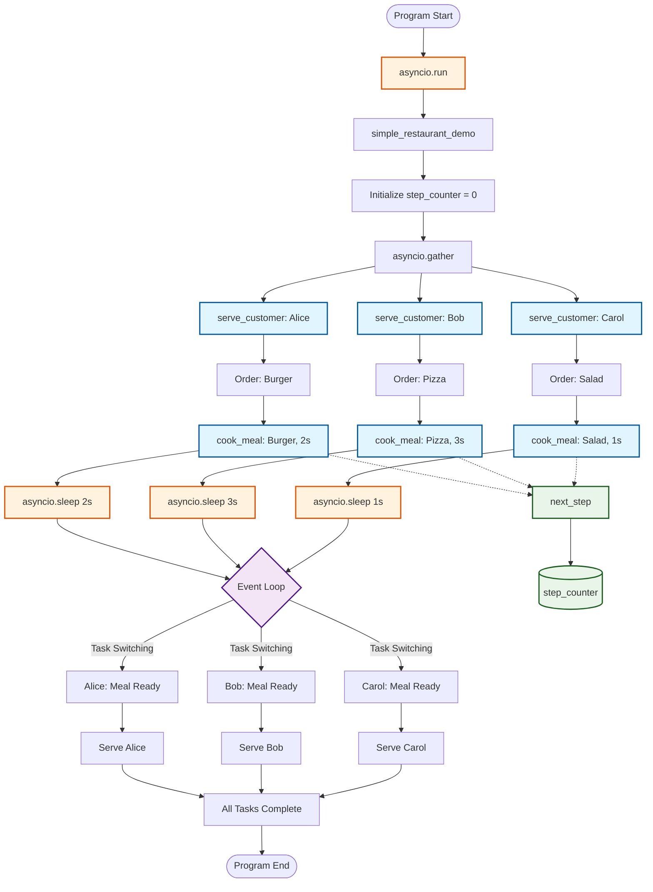

# Async/Await Event Loop Architecture

## Overview
This diagram illustrates the architecture of a Python asyncio-based restaurant simulation that demonstrates async/await patterns, event loop management, and concurrent execution.

## Architecture Diagram

## Key Components

### 1. **Entry Point**
- `asyncio.run()` - Creates and manages the event loop
- `simple_restaurant_demo()` - Main coroutine orchestrator

### 2. **Concurrency Management**
- `asyncio.gather()` - Runs multiple coroutines concurrently
- Event loop handles task switching and scheduling

### 3. **Customer Service Pipeline**
- `serve_customer()` - Handles individual customer requests
- `cook_meal()` - Simulates cooking with async delays
- `asyncio.sleep()` - Yields control to allow other tasks to run

### 4. **Utility Functions**
- `next_step()` - Synchronous function for step tracking
- `step_counter` - Global variable for execution tracking

## Event Loop Behavior

1. **Task Creation**: `asyncio.gather()` creates concurrent tasks
2. **Task Execution**: Each `serve_customer()` starts executing
3. **Yielding Control**: `asyncio.sleep()` pauses execution and yields to event loop
4. **Task Switching**: Event loop switches between ready tasks
5. **Resumption**: Tasks resume when their sleep/await completes
6. **Completion**: All tasks complete and results are gathered

## Learning Points

- **Concurrency vs Parallelism**: Tasks run concurrently but not in parallel
- **Event Loop**: Single-threaded cooperative multitasking
- **Await Points**: Where control can be yielded back to the event loop
- **Task Scheduling**: How the event loop manages multiple coroutines
